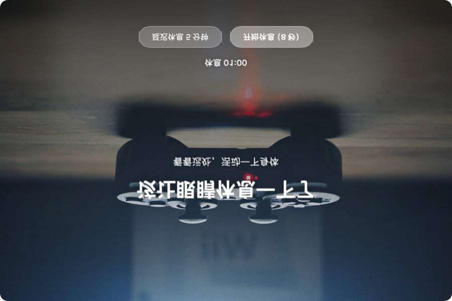
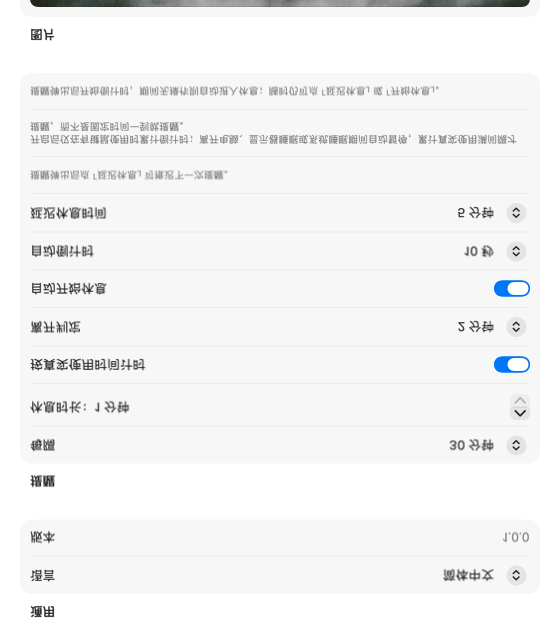

# Pause（休一下）

English | [简体中文](README.md)

A menu bar / system tray break reminder for **macOS and Windows**. It stays out of your way until it's time — then a beautiful large-scale nature image reminds you to leave the screen, look into the distance, and stretch.

> Since v2.0.0, Pause is rebuilt with [Tauri 2](https://tauri.app) (Rust + Svelte/TypeScript), replacing the single-platform Swift/SwiftUI version. Feature parity with the macOS original is 1:1.

## Preview

| Reminder | Settings |
| :---: | :---: |
|  |  |

When a reminder pops up, the "Start Break" button carries a live auto-start countdown (e.g. "Start Break (9s)"); do nothing and the break begins automatically. You can always delay or start manually.

## Highlights

- **Menu bar resident** — no Dock/taskbar presence; the tray shows minutes until the next break (`43m`), remaining break time, `⏸` when paused, `!` when due
- **Counts actual usage time** (default on): keyboard/mouse idle detection postpones the countdown while you are away, locked, in screensaver, display asleep or system asleep; you're reminded only after real usage fills the interval
- **No reminder storm**: deadlines are absolute timestamps; waking from sleep converts at most one overdue deadline into one reminder; reminders due during lock/screensaver/display-sleep wait and appear within a second of recovery
- **State machine**: `working → reminding → breaking → working`; delaying postpones by the delay interval only, unlimited times; pause/resume anytime
- **Wallpaper pipeline**: caches are loaded instantly and next images prefetched in background — popping a reminder **never waits on network**; defaults to picsum.photos random images (customizable to any http(s) URL); downloads are downsampled to ≤3200px and capped at 18 cached files; offline fallback renders one of four built-in gradient scenes
- **Motion**: slow Ken Burns zoom (1.00→1.05 over 45s round-trip), 0.8s crossfade between wallpapers, 0.4s page crossfade, window fade-in 0.35s / fade-out 0.5s; wallpapers rotate every 25s during breaks
- **Bilingual UI**: 简体中文 / English with instant switching (default English)
- Full settings: launch at login, gentle reminder sound, overlay-other-windows, window opacity (30%–100%), all saved immediately

## Install

Grab the latest build from [Releases](../../releases):

- **macOS**: `.dmg` per architecture. Drag the app into Applications. If blocked by Gatekeeper (unsigned): right-click → Open once, or `xattr -cr "/Applications/Pause.app"`
- **Windows**: `.msi` or `.exe`. Requires WebView2 Runtime (auto-downloaded if missing)

Build from source:

```bash
# Prerequisites: Node.js ≥ 18, Rust stable via rustup,
#   Xcode CLT on macOS / MSVC Build Tools on Windows
npm install
npm run tauri build     # bundles land in src-tauri/target/release/bundle/
```

## Development

```bash
npm install
npm run tauri dev
```

Menu items: **next-break countdown / Break Now / Pause Reminders / Settings… / Quit**.

## Architecture

```
src-tauri/src/            # Rust — single source of truth for logic & platform access
├── reminder/service.rs   #   timing state machine: phase/tick/snooze/idle-postponement/storm-guard
├── settings.rs           #   settings store (write-clamp vs read-fallback semantics, JSON file)
├── platform/             #   OS bridges: input-idle, lock/screensaver/sleep, multi-display geometry
├── wallpaper/            #   download, cache eviction (≤18 × ≤3200px), four-theme fallback art
├── tray.rs               #   tray icon + dynamic menu driven by built-in zh/en strings
├── windows.rs            #   reminder-window choreography: display placement, scaling, fades
└── lib.rs                #   wiring + per-second tick → orchestration/tray/push
src/                      # Svelte 5 + TS — thin view layer (events in, intents out)
```

Design notes:

- All state-machine advances and tray/window effects run serialized on the main thread (`run_on_main_thread`) — mirroring the original `@MainActor` model. Input-idle seconds are sampled by a background poller thread because querying CGEventSource directly on macOS's main thread deadlocks against the event loop.
- The view layer never blocks on network.
- Localization strings live in Rust `l10n.rs`; language switches push the whole dictionary to webviews and rebuild the native menus.

## Tests

```bash
cd src-tauri && cargo test      # 32 cases
```

Ported from the original Swift suite: state-machine flows (wake fires exactly once, unlimited snoozes, auto-start break), idle-postponement quadrant cases, ceil-based tray-minute publishing, clamp/fallback setting semantics, wallpaper URL validation, cache eviction plan, downsampling, mm:ss formatting, proportional window scaling.

## Demo modes (development)

```bash
PAUSE_DEMO=1 npm run tauri dev              # auto: reminder at 2s → start break → quit
PAUSE_DEMO_SETTINGS=1 npm run tauri dev     # opens Settings then quits after ~4s
PAUSE_DEBUG=1                               # append diagnostics to /tmp/pause_debug.log
```

## Known differences from the macOS-native original

1. The reminder sound is a bundled synthesized chime.wav instead of NSSound "Tink".
2. Windows trays cannot show text titles, so remaining minutes ride the tooltip (icon + status line); macOS keeps native text titles like `43m`.
3. "Overlay other windows" maps to always-on-top, approximating the original `.screenSaver` level.
4. The cartoon fallback scene is a simplified procedural re-draw in the same spirit.

## Acknowledgement

Code and docs were produced with assistance from ZCode, powered by GLM models from **[Zhipu AI (Z.ai)](https://z.ai)**.

## License

[MIT](LICENSE) © 2026 Vindac
