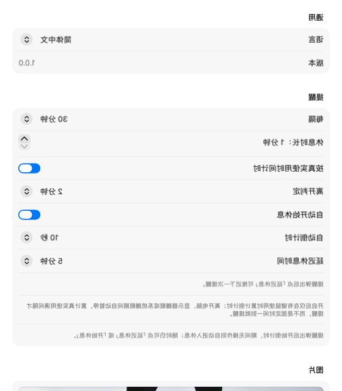

# 休一下（Pause）

[English](README.en.md) | 简体中文

一个常驻菜单栏/系统托盘的休息提醒工具，支持 **macOS 与 Windows**。平时几乎感觉不到它的存在，到点后用一张漂亮的大尺寸自然图片提醒你离开屏幕、看看远处、活动身体。

> v2.0.0 起由 [Tauri 2](https://tauri.app)（Rust + Svelte/TypeScript）重构实现，替代此前的 Swift/SwiftUI 单平台版本；功能与 macOS 原版 1:1 对齐。

## 界面预览

| 提醒页 | 设置页 |
| :---: | :---: |
|  |  |

提醒弹出时「开始休息」按钮直接附带自动倒计时（如「开始休息（9 秒）」），倒计时结束自动进入休息；期间随时可延迟或手动开始。

## 核心特性

- **菜单栏常驻**：不占 Dock/任务栏；菜单栏实时显示距下次休息的剩余分钟（如 `43m`）；休息中显示剩余分钟，暂停时 `⏸`，提醒待弹出时 `!`
- **按真实使用时间计时**（默认开启）：通过键鼠空闲检测判断你是否在电脑前 —— 离开、锁屏、屏保、显示器睡眠、系统睡眠的时段自动顺延倒计时，累计真实使用满间隔才提醒（可在设置关闭或调整「离开判定」阈值）
- **防提醒风暴**：deadline 为绝对时间；唤醒后第一次心跳只把一个已过期的 deadline 转换为一次提醒；锁屏/屏保/屏幕睡眠期间到期则暂缓，环境恢复后 1 秒内弹出
- **状态机**：`working → reminding → breaking → working`；延迟休息只推迟所设分钟数且次数不限；可随时暂停/继续
- **壁纸管线**：启动即从缓存装填并后台预取下一张，提醒弹出**永不等待网络**；默认 picsum.photos 随机图（可自定义任意 http(s) 图片地址）；下载后降采样 ≤3200px 缓存最多 18 张自动淘汰；断网/首次运行使用内置四主题渐变插画兜底
- **动效**：Ken Burns 极慢缩放（1.00→1.05，45s 往返）+ 切图交叉淡化 0.8s + 两页切换淡化 0.4s + 窗体淡入 0.35s/淡出 0.5s；休息期间每 25 秒自动换图
- **多语言**：中文 / English 运行时即时切换（默认英文）
- **开机启动、提示音、窗口透明度（30%–100%）、覆盖其他窗口开关**等完整设置项，修改即保存

## 下载安装

前往 [Releases](../../releases) 页面获取最新安装包：

- **macOS**：`.dmg`（Apple Silicon 与 Intel 分包）。打开后将「休一下」拖入「应用程序」。
  应用未做 Apple 公证，首次双击会被 Gatekeeper 拦截（提示「已损坏」或「无法验证开发者」）。
  打开「终端」（Terminal，可在启动台搜索），粘贴执行下面这条命令后即可正常打开：

  ```bash
  xattr -cr "/Applications/休一下.app"
  ```

  提示：命令末尾的路径也可以输入 `xattr -cr ` 后，把「应用程序」里的「休一下」直接拖进终端窗口自动补全。
- **Windows**：`.msi` 或 `.exe` 安装包。需要 WebView2 Runtime（缺失时安装器会自动下载）

也可从源码构建：

```bash
# 前置依赖：Node.js ≥ 18、Rust stable（rustup）、
#   macOS 需 Xcode Command Line Tools；Windows 需 MSVC Build Tools
npm install
npm run tauri build     # 产物位于 src-tauri/target/release/bundle/
```

## 开发运行

```bash
npm install
npm run tauri dev       # 开发模式（vite HMR + Rust debug 构建）
```

启动后菜单栏（macOS）或系统托盘（Windows）出现应用图标与剩余时间。点菜单：**下次休息倒计时 / 立即休息 / 暂停提醒 / 设置… / 退出**。

## 架构速览

```
src-tauri/src/            # Rust：业务逻辑单一事实来源（对应原 MVVM 的 Service 层）
├── reminder/service.rs   #   计时状态机（唯一真相源）：phase/tick/延迟/空闲顺延/防风暴
├── settings.rs           #   设置存储（写入钳制 / 读取回退双语义 + JSON 持久化）
├── platform/             #   平台桥：键鼠空闲、锁屏/屏保/睡眠监听、多屏几何
│   ├── macos.rs          #     CGEventSource / NSDistributedNotificationCenter+NSWorkspace / NSScreen
│   └── windows.rs        #     GetLastInputInfo / WTS 会话通知+电源广播 / EnumDisplayMonitors
├── wallpaper/            #   下载(provider)、缓存淘汰(cache)、四主题兜底插画(fallback)
├── tray.rs               #   托盘图标 + 动态菜单（52+ 条内建中英文案驱动）
├── windows.rs            #   提醒窗编排：多屏定位、40pt 内缩等比缩放、显隐时序
└── lib.rs                #   组装与运行时编排（秒级心跳 → 编排/托盘/推送）
src/                      # Svelte 5 + TS：纯视图层（收事件、发意图）
├── lib/ReminderApp.svelte    # 提醒页 + 休息页（同窗 opacity 切换防闪空；Ken Burns/玻璃按钮）
├── lib/SettingsApp.svelte    # 五组设置控件
├── lib/state.svelte.ts       # 快照状态与命令封装
└── lib/i18n.svelte.ts        # 响应式字典（由 Rust 推送全量文案）
```

设计原则：

- **主线程串行**：全部状态机推进与托盘/窗口动作经 `run_on_main_thread` 串行执行（对齐原版 `@MainActor` 模型）；键鼠空闲值由后台线程轮询缓存供读——macOS 上绝不在主线程直查 CGEventSource（会与事件循环死锁）
- **前端永不阻塞**：提醒弹窗只消费已就绪图片；所有网络动作均在后台任务进行
- **文案单一来源**：中英字典内建于 Rust `l10n.rs`，语言切换时整体推送前端并重建托盘菜单

## 测试

```bash
cd src-tauri && cargo test      # 33 个用例
```

覆盖移植自原 Swift 测试套件：状态机全流程（含唤醒只弹一次、无限延迟、自动开始休息）、空闲顺延纯函数四象限、菜单分钟 ceil 语义、设置钳制/回退双语义、壁纸 URL 校验、缓存淘汰计划、降采样、mm:ss 格式化、900×600 小屏等比缩放等。

## 演示模式（开发用）

```bash
PAUSE_DEMO=1 npm run tauri dev              # 自动演示：2s 弹提醒 → 开始休息 → 退出
PAUSE_DEMO_SETTINGS=1 npm run tauri dev     # 打开设置窗 4 秒后退出
PAUSE_DEBUG=1                               # 追加写 /tmp(pause_debug.log) 诊断日志
```

## 与 macOS 原生版的已知差异

1. 提示音为内置合成的 chime.wav（替代 NSSound "Tink"）
2. Windows 托盘不支持原生文字标题，以「图标 + tooltip 完整状态行」表达剩余分钟；macOS 仍为原生文本标题（如 `43m`）
3. 「覆盖其他窗口」以 always-on-top 实现，近似原 `.screenSaver` 层级
4. 兜底插画的 cartoon 主题为风格一致的程序化简化重绘

明确不做（延续原版决策）：账号、云同步、任务管理、打卡、复杂统计、社区、订阅、广告、插件系统。

## 声明

本项目代码与文档由 **[智谱 AI（Z.ai / Zhipu AI）的 GLM 大模型](https://z.ai)** 驱动的 ZCode 编程智能体辅助生成。

## 许可证

[MIT](LICENSE) © 2026 Vindac
